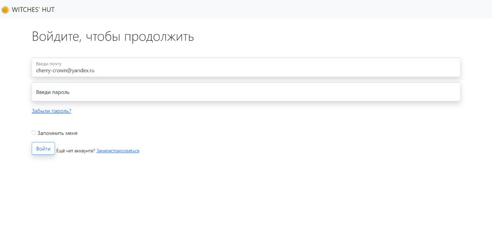

# Название проекта #

_Кратко предметная область_:
- Сервер на *оккультную тему*, набирающую популярность в последнее время
- Описание карт таро, игральных карт, расклады на любых картах по выбору
- Гороскоп, места силы для обучения, совместимость по имени и знаку зодиака
- Возможность авторизации и получения дополнительных функций, бот в телеграме


 

### Описание ### 
* На стартовой странице вебсайта есть введение и основной список терминов, с которыми нужно ознакомиться.
* У пользователя есть возможность узнать гороскоп на сегодня, изучить описание всех Игральных карт и карт Таро, получить расклад от выбранного им специалиста и узнать, где в России находятся самые классные ведьмовские места.
* Авторизованные пользователи могут узнать совместимость людей по знаку зодиака или имени, получить бесплатный расклад в приложении и получить скидку 15% на расклад от специалиста.
* Если пользователь не авторизован (или не зарегистрирован) на нашем сервере,  ему будет предложено авторизоваться (зарегистрироваться) или восстановить доступ к старому аккаунту
 
* На странице Справочника можно ознакомиться с описанием всех карт (как Таро, так и Игральных) 

* На странице Совместимостей можно узнать совместимость людей по знаку зодиака или имени.
  
* На странице Совместимостей можно узнать совместимость людей по знаку зодиака или имени.
   
* На странице Мест силы можно увидеть авторский список энергетически заряженных мест, которые стоит посетить.

* На странице Гороскопа можно узнать гороскоп для любого знака зодиака на текущий день и следующий.
 
* Бот предназначен для получения гороскопа и связи с создателями проекта и/или специалистами-гадателями. Список команд бота предоставляется сразу после его запуска
 

 

### Технологии в проекте ###

Приложение написано на языке программирования Python c использованием микро-фреймворка flask и прочих вспомогательных библиотек (datetime, json, random, smtplib, os)

В папке templates хранятся HTML-шаблоны.  
При создании форм используется объектный подход с помощью библиотеки flask-wtf.  
Веб-приложение работает с базой данных через ORM sqlalchemy.

- Все необходимые ресурсы хранятся в папке static. Собственные стили описаны в файле css/style.css.  
- Некоторые компоненты (например, панель навигации) взяты как шаблоны bootstrap.   
- Описания всех карт и гороскоп хранятся в папке json в файлах all_cards.json и horoscope.json  
- Все картинки и иллюстрации, используемые на сайте, хранятся в папке img, а текстовые - в txt  
- Дополнительные файлы (такие, как bots.py, finder.py) хранятся в папке extra_files

Регистрационные данные пользователей, совместимости по именам и знакам зодиака хранятся 
в базе данных SQLite webproject.db   
Пароли проверяются на надёжность и хранятся в БД в хешированном виде. 

### Техническое описание проекта ###
Для запуска приложения необходимо запустить файл main.py  

Тестовый пользователь: cherry-crown@yandex.ru (пароль: 123) 

Для запуска бота: 
1. Зарегистрировать своего бота и получить API-TOKEN: ( https://core.telegram.org/bots/api )
2. Создать в проекте файл **.env** со следующим содержанием:

```
BOT_TOKEN = '5203153515:AAERauMdg8tGZ48kzgQBy-QEdGLQnsWT1_g'
```

(Чтобы установить все зависимости 
достаточно в консоли (терминале) вызвать команду  
pip install -r requirements.txt )

---
- Авторы: Гуляева Юлия (PinguinCake), Квитка Мария (tortik13), Даниелян Сергей (danielyan-s)
- Отслеживать прогресс: https://docs.google.com/spreadsheets/d/1P-f_EiwEDrhnxPub51_DPax4j1jXkz5hizljlqbEc7w/edit#gid=335361012
- Проект размещен в интернете по адресу: https://abc.herokuapp.com/